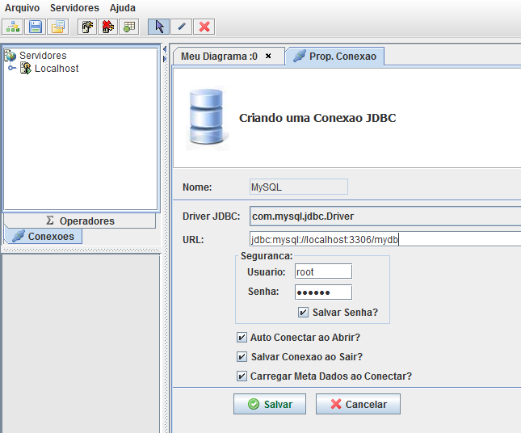
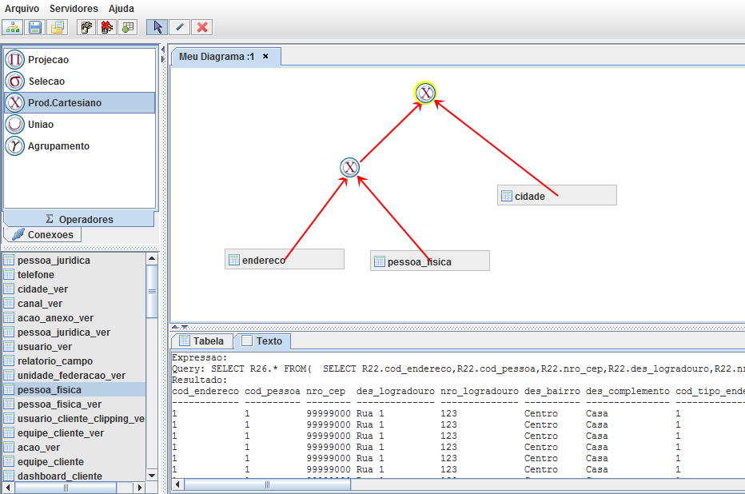
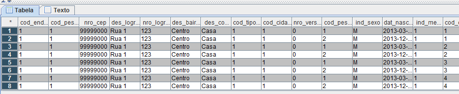

# VisualSQL

Is a visual tool that allows you to use relational algebra operators to interact with a real database. Built in support for MySQL.

Wiki: [Relational Algebra(Wiki)](https://en.wikipedia.org/wiki/Relational_algebra)

## Getting Started

After building the application VisualSQL can be started from the bat file VisualSQL.bat.

* First step is to create a connection.



After crating the connection you will have to select it for it to be considered active.

* Now lets create a diagram by the selecting  operators and tables from the left panels. The generated SQL and the values are presented right below.



A table with the result is also displayed.



### Prerequisites

The tool was developed as an Applet using Java 6.

We have a simple stack:
* Java 6
* Applet
* MySQL (embedded driver)
* JDOM
* Maven

### Installing

To build and generate the distribution Jar-file:
```
mvn package
```

## Running the tests

```
mvn test
```

## License

This project is licensed under the MIT License - see the [LICENSE.md](LICENSE.md) file for details
